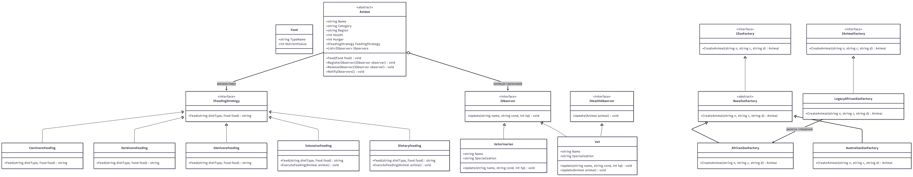

# Симулятор Зоопарку (ZooSimulator)

Навчальний проєкт з об'єктно-орієнтованого програмування, що моделює роботу інформаційної системи зоопарку для автоматизації обліку тварин, вольєрів, персоналу та процесів догляду з використанням архітектурних патернів, механізмів обробки винятків та модульного тестування.

---

## Патерни проєктування

У ході виконання проєкту було інтегровано три архітектурні патерни проєктування:

1. **Abstract Factory (Абстрактна фабрика)**
   * **Призначення:** Створення родин пов'язаних об'єктів без прив'язки до їхніх конкретних класів для забезпечення масштабованості екосистеми.
   * **Реалізація:** Інтерфейс `IZooFactory` визначає контракти для генерації об'єктів. Конкретні фабрики `AfricanZooFactory` та `AustralianZooFactory` створюють відповідні типи тварин (`Mammal`, `Bird`) та прив'язані до них типи вольєрів (`Enclosure`) зі специфічним середовищем.

2. **Strategy (Стратегія)**
   * **Призначення:** Інкапсуляція сімейства алгоритмів годування тварин та забезпечення їх динамічної заміни під час виконання програми.
   * **Реалізація:** Інтерфейс `IFeedingStrategy` реалізовано у класах `CarnivoreFeeding` (алгоритм харчування хижаків, що потребує лише м'яса) та `HerbivoreFeeding` (алгоритм харчування травоїдних).

3. **Observer (Спостерігач)**
   * **Призначення:** Організація слабкої зв'язності між об'єктами, що дозволяє автоматично сповіщати залежні служби про зміни стану суб'єкта.
   * **Реалізація:** Клас `Animal` виступає видавцем подій. Об'єкт `Veterinarian` реалізує інтерфейс `IObserver` і підписується на зміну показників здоров'я. При зниженні рівня здоров'я тварини до критичної позначки (нижче 30%) ветеринарна служба миттєво отримує сповіщення про тривогу.

---

## Обробка винятків та бізнес-логіка

Для захисту системи від логічних помилок догляду та некоректних дій розроблено кастомний тип винятку `ZooException`:
* **Захист від невідповідного корму:** Система перевіряє сумісність типу їжі зі стратегією годування. Спроба нагодувати хижака рослинною їжею або травоїдну тварину м'ясом переривається генерацією `ZooException`.
* **Захист від перевитрати (Overfeeding):** Якщо показник голоду тварини дорівнює нулю (`Hunger = 0`), наступні спроби годування блокуються для оптимізації витрат ресурсів.
* **Політика Retry:** Усі критичні виклики обгорнуті в блоки `try-catch`. У разі перехоплення `ZooException` програма не завершує роботу аварійно, а виконує безпечне логування помилки та повертає виділений корм на склад.

---

## Серіалізація та Data Transfer Objects (DTO)

Для тривалого збереження стану системи реалізовано механізм експорту даних на основі бібліотеки `System.Text.Json`. Відповідно до принципів чистої архітектури виконано розділення доменних моделей та моделей збереження:
* Створено класи `AnimalDto` та `ZooStateDto`, які містять виключно чисті дані для збереження (ім'я, тип, здоров'я, голод).
* Це дозволяє уникнути серіалізації внутрішньої логіки, посилань на інтерфейси патернів (`IFeedingStrategy`), подій та циклічних залежностей.
* У налаштуваннях `JsonSerializerOptions` додано параметр красивого форматування тексту `WriteIndented` та енкодер кирилиці для коректного збереження файлу `zoo_state.json` з підтримкою української мови.

---

## Структурна UML-діаграма класів

---

## Модульне тестування

Проєкт покритий автоматизованими юніт-тестами на базі фреймворку xUnit. Тести побудовані за методологією AAA (Arrange-Act-Assert):
1.`CarnivoreFeeding_WithCorrectFood_ShouldReturnSuccessMessage` — перевірка успішного відпрацювання стратегії годування хижака м'ясом.
2.`CarnivoreFeeding_WithIncorrectFood_ShouldThrowZooException` — валідація виникнення помилки при спробі дати хижаку рослинний корм.
3.`Feed_WhenAnimalIsAlreadyFull_ShouldThrowZooException` — перевірка роботи захисного механізму проти надлишкового годування ситої тварини.
4.`HerbivoreFeeding_WithMeat_ShouldThrowZooException`— тестування реакції травоїдної тварини на несумісний м'ясний раціон.
5.`AfricanZooFactory_ShouldCreateMammalWithCarnivoreStrategy` — перевірка коректності створення об'єктів абстрактною фабрикою та автоматичного призначення правильної стратегії.
6.`Observer_ShouldBeTriggered_WhenHealthDropsToCritical` — ізольована перевірка патерну спостерігача. Для усунення залежності від консолі та зовнішнього середовища використано бібліотеку Moq, за допомогою якої створено Mock-об'єкт ветеринара для фіксації виклику методу Update.

---

