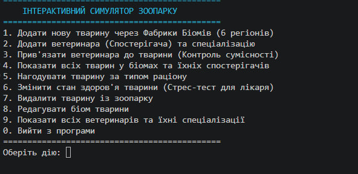

# Симулятор Зоопарку (ZooSimulator)

Навчальний проєкт з об'єктно-орієнтованого програмування, що моделює роботу інформаційної системи зоопарку для автоматизації обліку тварин, вольєрів, персоналу та процесів догляду з використанням сучасних архітектурних патернів, механізмів обробки винятків, узагальненого кешування, серіалізації даних та комплексного модульного тестування.

---

## Архітектура проєкту

Проєкт спроєктовано із дотриманням принципів чистої архітектури (Clean Architecture) та розділення відповідальностей (Separation of Concerns). Програма розділена на логічні шари:
* **Доменні моделі (Domain Models):** Базові класи та інтерфейси сутностей зоопарку (`Animal`, `GenericAnimal`, `Food`), які містять чисту бізнес-логіку та інкапсульовані стани.
* **Поведінкові компоненти та стратегії:** Шаблони, що керують алгоритмами взаємодії сутностей (стратегії годування, спостерігачі для медичного моніторингу).
* **Шар інфраструктури та персистентності:** Компоненти узагальненого кешування (`Cache<TKey, TValue>`) та об'єкти передачі даних (DTO) для серіалізації поточного стану системи у формати JSON/XML.

---

## Структурна UML-діаграма класів

---

## Патерни проєктування

У ході розробки архітектури проєкту було інтегровано три фундаментальні патерни проєктування:

1. **Abstract Factory (Абстрактна фабрика)**
   * **Призначення:** Створення родин пов'язаних об'єктів без прив'язки до їхніх конкретних класів для забезпечення масштабованості та ізоляції біомів зоопарку.
   * **Реалізація:** Інтерфейс `IZooFactory` та базовий клас `BaseZooFactory` визначають контракти для генерації об'єктів. Конкретні регіональні фабрики `AfricanZooFactory`, `AustralianZooFactory` та `ArcticZooFactory` створюють екземпляри тварин (`GenericAnimal`) із автоматично налаштованими параметрами відповідного географічного біому та базового раціону.

2. **Strategy (Стратегія)**
   * **Призначення:** Інкапсуляція сімейства алгоритмів годування тварин та забезпечення їх динамічної заміни та валідації під час виконання програми.
   * **Реалізація:** Інтерфейс `IFeedingStrategy` реалізовано у трьох класах-стратегіях: `CarnivoreFeeding` (раціон хижаків, що приймає лише м'ясо та рибу), `HerbivoreFeeding` (раціон травоїдних, що приймає траву та листя) та `OmnivoreFeeding` (універсальний раціон всеїдних тварин).

3. **Observer (Спостерігач)**
   * **Призначення:** Організація слабкої зв'язності між об'єктами, що дозволяє автоматично сповіщати залежні служби про критичні зміни стану суб'єкта.
   * **Реалізація:** Клас тварини виступає видавцем подій, реалізуючи методи реєстрації та сповіщення підписників. Об'єкти медичної служби `Veterinarian` реалізують інтерфейс `IObserver`. Будь-яка зміна показника здоров'я тварини автоматично транслює подію ветеринарам, а за умови падіння рівня здоров'я нижче критичної позначки (менше 30%) лікар з відповідною біологічною спеціалізацією миттєво реагує на тривогу.

---

## Узагальнене кешування даних

Для оптимізації доступу до даних та централізованого управління сутностями в оперативній пам'яті симулятора було спроєктовано та реалізовано узагальнений компонент кешування:
* **Клас `Cache<TKey, TValue>`:** Використовує параметризовані типи даних (.NET Generics) для забезпечення повної типізаційної безпеки (Type Safety) без необхідності операцій приведення типів (boxing/unboxing).
* **Функціональність:** Забезпечує високошвидкісне збереження, перевірку наявності ключа, безпечне зчитування значень (повертає `null` замість генерації збою у разі відсутності запису) та автоматичне перезаписування застарілих даних при повторному додаванні елементів.

---

## Обробка винятків та бізнес-логіка

Для захисту системи від логічних помилок догляду, некоректного розподілу ресурсів та помилок користувача розроблено та застосовано кастомний тип винятку `ZooException`:
* **Захист від невідповідного корму:** Система перевіряє сумісність обраного типу їжі (`Food`) зі встановленою стратегією годування тварини. Спроба згодувати рослинний корм хижаку чи м'ясні продукти травоїдному негайно блокується генерацією `ZooException`.
* **Захист від перевитрати (Overfeeding):** Якщо показник голоду тварини дорівнює нулю (`Hunger = 0`), тварина вважається повністю ситою. Наступні спроби годування блокуються винятком задля оптимізації ресурсів зоопарку.
* **Захист при призначенні персоналу:** Механізм реєстрації спостерігачів валідує відповідність біологічної спеціалізації ветеринара та категорії тварини, запобігаючи помилковому закріпленню лікарів за невідповідними вольєрами через `ZooException`.
* **Політика відмовостійкості:** Усі критичні точки викликів бізнес-логіки захищені блоками `try-catch`. Виникнення помилки не призводить до аварійного завершення застосунку, а безпечно обробляється через логування та інформування користувача.

---

## Серіалізація та Data Transfer Objects (DTO)

Для тривалого збереження стану симулятора між сесіями роботи застосунку реалізовано механізми збереження та зчитування даних на основі бібліотеки `System.Text.Json`. Відповідно до принципів чистої архітектури виконано повне розділення об'єктів бізнес-логіки та шару персистентності:
* **Патерн DTO:** Створено окремі класи `ZooStateDto`, `AnimalDto` та `VetDto` (файл `ZooDto.cs`), які містять виключно чисті властивості даних.
* **Усунення архітектурних обмежень:** Використання DTO дозволило повністю уникнути спроб серіалізації внутрішньої логіки об'єктів, посилань на інтерфейси патернів (`IFeedingStrategy`), подій та вирішило проблему циклічних посилань між тваринами та ветеринарами.
* **Конфігурація:** В параметрах `JsonSerializerOptions` задіяно властивість `WriteIndented` для красивого форматування тексту та Unicode-енкодер для коректного збереження файлів бази даних (`zoo_state.json` та структурованого `zoo_state.xml`) з повною підтримкою української мови.

---

## Модульне тестування (xUnit & Moq)

Проєкт покритий комплексним набором з **24 автоматизованих юніт-тестів** на базі фреймворку `xUnit`. Тести побудовані за методологією AAA (Arrange-Act-Assert) та повністю ізольовані від консольного інтерфейсу введення-виведення.

### Охоплення тестових сценаріїв:
1. **Тести стану об'єктів (`GenericAnimal`):** Валідація правильної початкової ініціалізації властивостей через конструктор та перевірка математичного обмеження показників здоров'я та голоду строго в межах $[0, 100]\%$.
2. **Тести патерну Стратегія:** Перевірка успішного прийняття коректних типів їжі стратегіями, генерація `ZooException` при виявленні несумісного раціону, контроль блокування годування ситих тварин та успішне зменшення показника голоду на поживну цінність корму.
3. **Тести патерну Фабрика:** Перевірка відповідності встановлених географічних біомів та автоматичного налаштування типів раціону при створенні об'єктів через регіональні фабрики.
4. **Тести патерну Спостерігач (Із застосуванням Moq):** Валідація успішного додавання лікарів до списків підписників тварини. Для повної ізоляції тестування логіки сповіщень використано бібліотеку мокінгу `Moq`, за допомогою якої згенеровано макети об'єктів `Mock<IObserver>` та виконано верифікацію викликів методу `Update` через `.Verify()`.
5. **Тести компонента кешування:** Перевірка безпомилкового збереження та вилучення об'єктів за ключем у `Cache`, верифікація повернення `null` для неіснуючих ключів, робота індикатора наявності запису та перевірка логіки перезапису даних за умови дублювання ідентифікаторів.

---

## Приклад використання та бізнес-сценарії

В основі роботи симулятора лежить інтерактивне консольне меню управління:

### Сценарій 1: Додавання тварини та автоматичне налаштування фабрикою
Користувач обирає пункт `1`, вводить ім'я тварини "Сімба", категорію "Ссавець" та обирає **Африканський біом**. Фабрика `AfricanZooFactory` автоматично створює об'єкт тварини, реєструє регіон "Африканський біом" та підставляє об'єкт класу `HerbivoreFeeding` як поточну стратегію харчування.

### Сценарій 2: Спроба некоректного годування (Обробка винятку)
Користувач обирає пункт `2` для годування "Сімби" та вказує тип їжі "М'ясо". Система звертається до поточної стратегії тварини. Оскільки "Сімба" ініціалізований як травоїдний, стратегія генерує `ZooException`. Програма перехоплює його, виводить на екран повідомлення: `[ПОМИЛКА ЗООПАРКУ]: Тварина лякається і відмовляється їсти М'ясо!`, і повертає користувача в головне меню без збою програми.

### Сценарій 3: Робота спостерігача при погіршенні стану
Користувач через пункт `3` призначає лікаря "Доктор Джон" зі спеціалізацією "Ссавець" для догляду за "Сімбою". Далі через пункт `4` користувач штучно знижує здоров'я тварини до `20%`. Сетер класу `Animal` автоматично ініціює виклик `NotifyObservers()`. На консоль виводиться миттєве сповіщення: `[УВАГА ЛІКАРЯ]: Доктор Джон отримав сигнал! Тварина Сімба (Категорія: Ссавець) у критичному стані! Поточне здоров'я: 20%!`.

---

## CHANGELOG (Журнал змін проєкту)

### [1.0.0] - 18.05.2026 (Завдання 1-2)
* Проведено аналіз предметної області та сформовано вимоги до симулятора зоопарку.
* Створено базовий каркас класів, реалізовано базову ієрархію сутностей.

### [1.1.0] - 20.05.2026 (Завдання 3)
* Проведено глобальний рефакторинг архітектури: впроваджено паттерн **Abstract Factory** (створено `IZooFactory`, `AfricanZooFactory`, `AustralianZooFactory`, `ArcticZooFactory`).
* Створено узагальнений клас `GenericAnimal` для усунення жорсткого наслідування.

### [1.2.0] - 22.05.2026 (Завдання 4)
* Інтегровано паттерн **Strategy** для динамічного управління раціонами тварин (`CarnivoreFeeding`, `HerbivoreFeeding`, `OmnivoreFeeding`).
* Реалізовано кастомний клас винятків `ZooException` для контролю сумісності типів корму.

### [1.3.0] - 25.05.2026 (Завдання 5)
* Впроваджено поведінковий паттерн **Observer** для автоматизації медичного моніторингу ветеринарами стану здоров'я тварин.
* Додано валідацію спеціалізації лікарів при підписці на події.

### [1.4.0] - 27.05.2026 (Завдання 6)
* Створено та інтегровано узагальнений компонент кешування даних `Cache<TKey, TValue>`.
* Реалізовано шар збереження даних (персистентність) за допомогою `System.Text.Json` та `System.Xml.Serialization` із застосуванням архітектурного патерну **DTO**.

### [1.5.0] - 29.05.2026 (Завдання 7)
* Створено тестовий проєкт на базі **xUnit**. Написано 24 автоматизовані тести для покриття бізнес-логіки.
* Інтегровано бібліотеку **Moq** для ізольованого тестування логіки сповіщень спостерігачів.
* Проведено фінальний рефакторинг та оформлено технічную документацію програми до захисту.